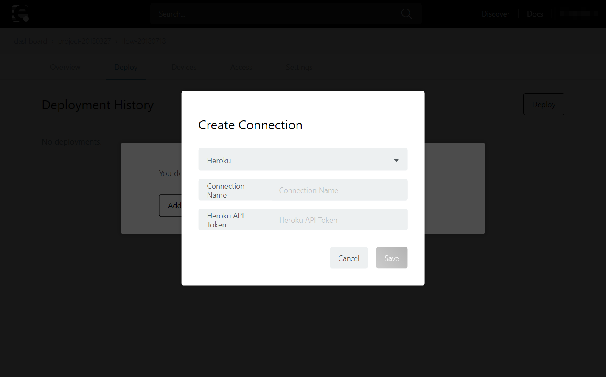
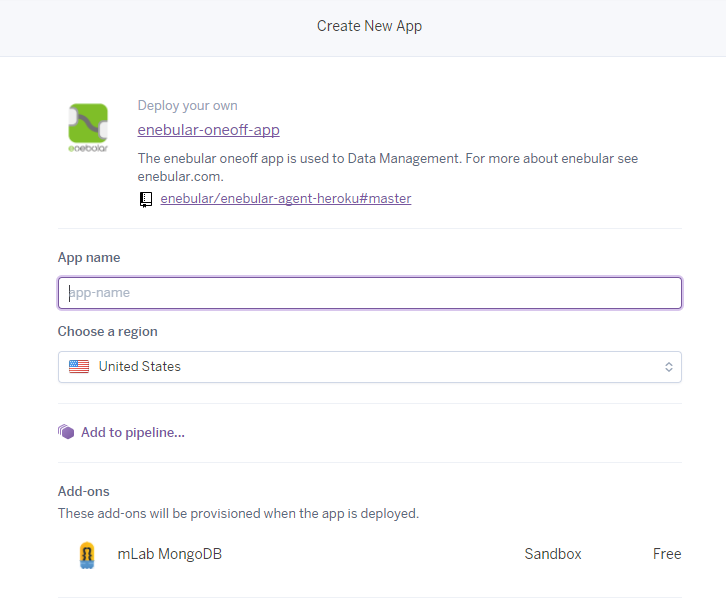
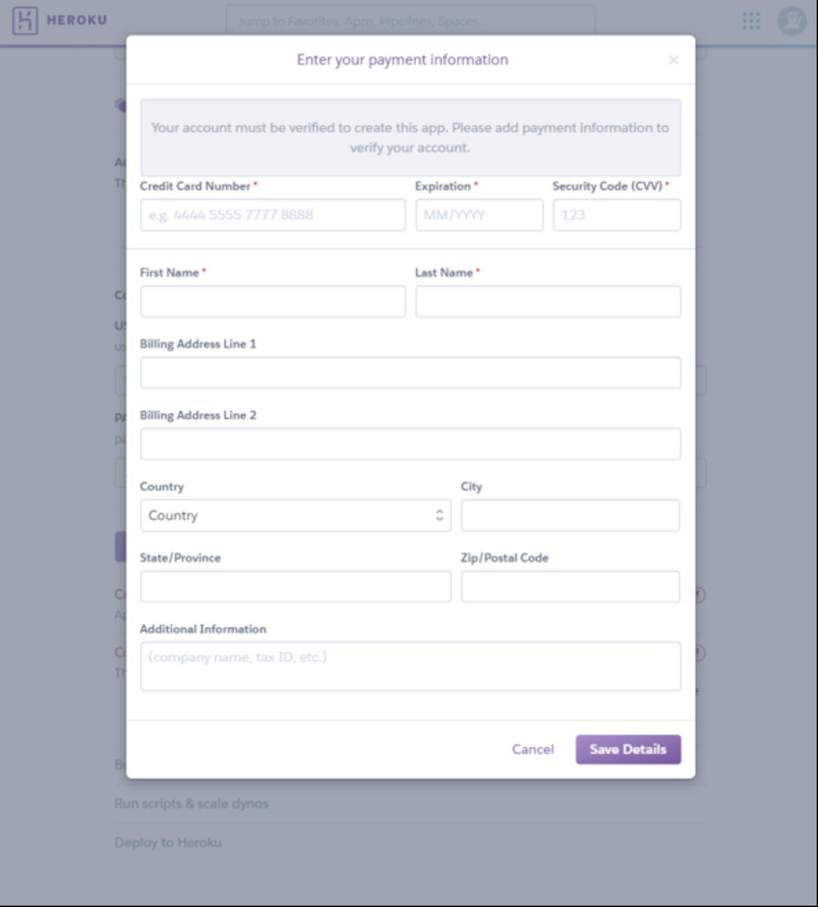
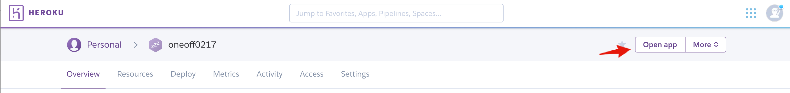

## Flow Deployment

enebularの特徴として、作成したフローを様々な環境にデプロイし動作させるというものがあります。

このチュートリアルでは、「フローを別のサービス（Heroku）にデプロイし動作する」ということをします。（所要時間40分）

このチュートリアルでは以下のことを行います。

なお、本ページは[Introduction](http://docs.enebular.com/ja/getstarted/Introduction.html)のチュートリアルで Asset(フロー)の作成方法については理解していることを前提としています。
Herokuアカウントの取得については、[Heroku](https://heroku.com)から進めてください。

### Table of Contents
---
1.  [Herokuに送るフローを作成](FlowDeployment.html#Herokuに送るフローを作成)
2.  [デプロイの設定](FlowDeployment.html#デプロイの設定)
3.  [Herokuボタンでアプリを作成](FlowDeployment.html#Herokuボタンでアプリを作成)
4.  [フローのデプロイ](FlowDeployment.html#フローのデプロイ)

Heroku に送るフローを作成

 

Assetsからフローを作成します（既にフローを作成済みの場合、それを利用することも可能です）。

Heroku に送りたいフローを作成して、デプロイして保存します。

### デプロイの設定

つづいて、デプロイの設定をします。
フローが作成できたら上部のメニューから Deploy ページに移動します。

表示された画面の Add Connection をクリックします。

Select Connection Type から Heroku を選択します。 Connection Nameはわかりやすい名前をつけます。Heroku API Token は Herokuの設定画面で確認します。

Herokuにログイン後ページ右上にある [Account Settings] を押します。

Manage Account ページで Account ページに移動します。

API Key 欄に移動し [Reveal] で API Key を表示します。

Heroku API Token に API Key をコピーして、[Save] を押します。

新しくconnectionが追加されたので、クリックしてください。

開いた画面の下部にある [Deploy to Heroku] からアプリを作成します。

### Heroku ボタンでアプリを作成

Herokuボタンでアプリを作成します。すでに作成されている方は読み飛ばして下さい。
Heroku ボタンを押すとログインしていない場合、Herokuのログイン画面が出てくるのでログインします。

Heroku のアプリ設定が表示されます。

App name をわかりやすい名前で設定します。

作成後 の enebular Node-RED のログインするための USERNAME/PASSWORDを設定します。

入力が完了したら Deploy app ボタンを押下してデプロイを行ってください。

Herokuにクレジットカード情報を登録していない場合、以下のような入力画面が出ますが、本アプリは無料で利用できますので入力して継続ください。

情報を入力すると、アプリの作成が始まります。

下記のようにアプリが作成されていきます。 アプリの作成が完了すると Viewボタンが表示されるので押下します。

アプリが立ち上がり、enebular にログインするための USERNAME/PASSWORDの入力を求められます。
さきほど設定したものを入力してログインします。エディタが表示されることを確認します。

### フローのデプロイ

保存されると Select Connection Type から Heroku を選択すると、Herokuアカウントが持つアプリ一覧が出てきます。

こちらから、さきほど作成した Heroku アプリをひとつチェックし [Deploy]を押します。

しばらく待っていると Deploy Added が表示されてデプロイが完了します。

Heroku アプリで確認すると無事フローがデプロイされています。

反映されたフローを確認します。

### Well Done!

enebular のデプロイ機能を使用して、作成したAsset(フロー)を別のサービスにデプロイすることが出来るようになりました。
