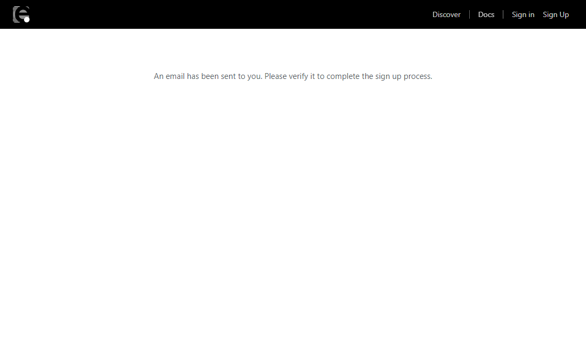
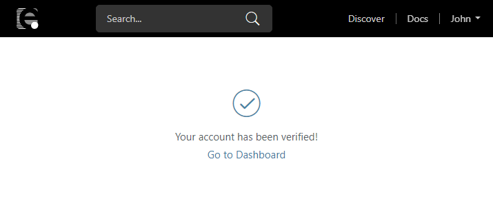
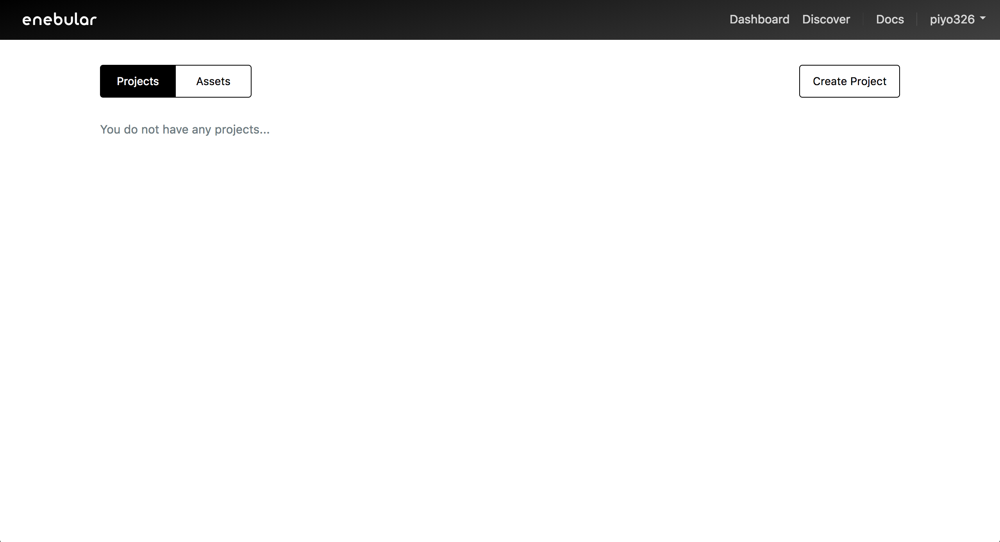
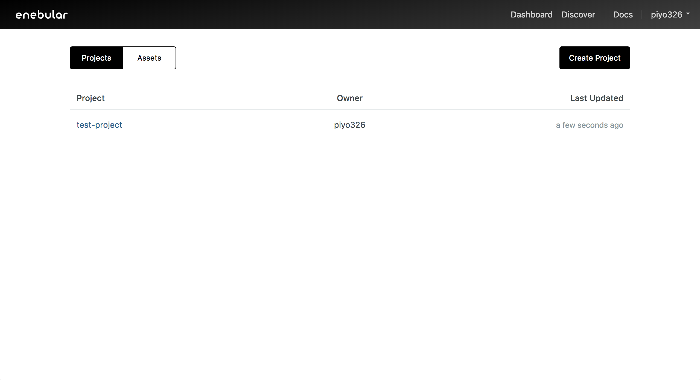
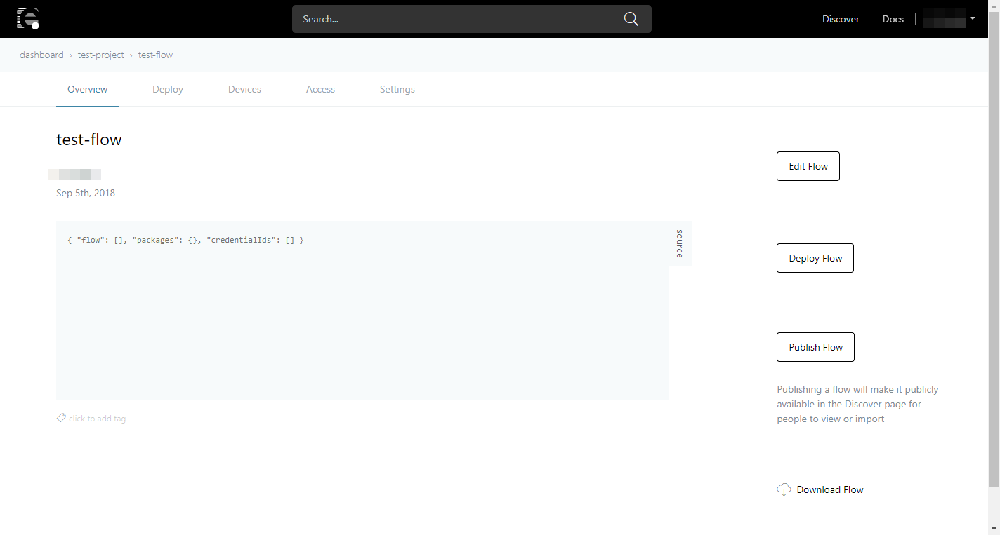
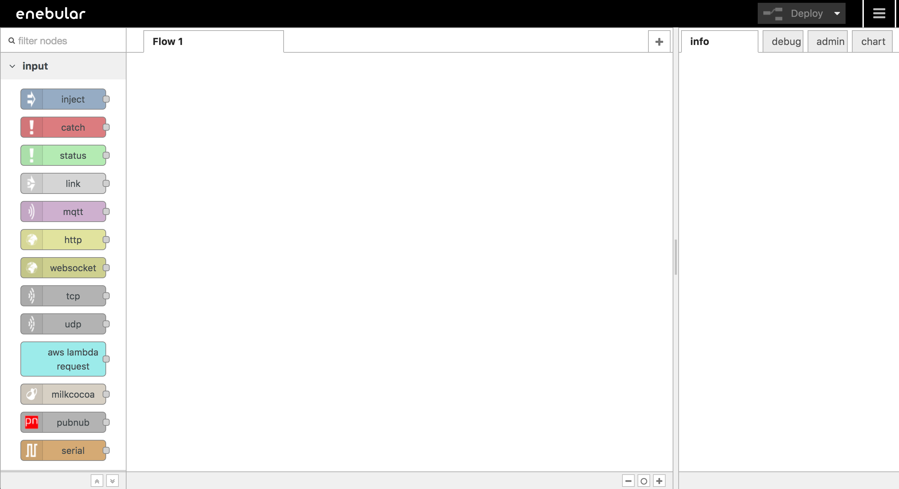
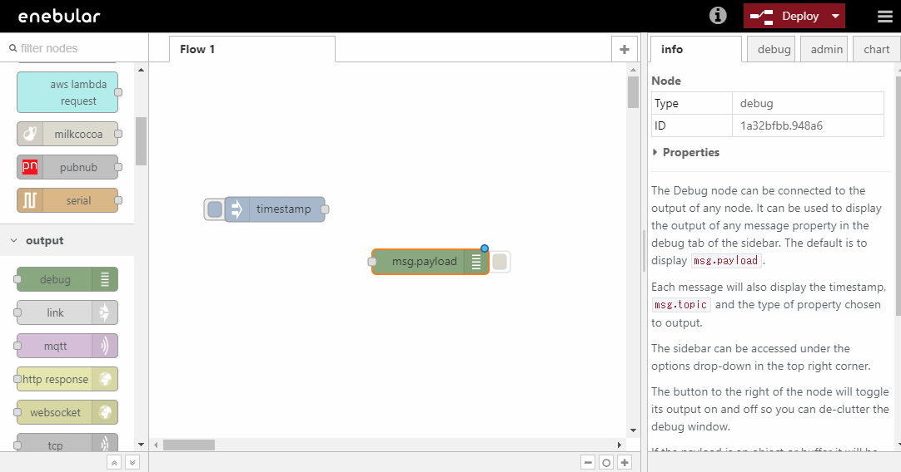
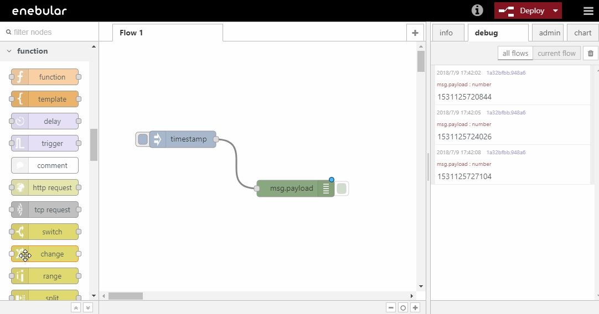

# Introduction
このチュートリアルでは「enebularにサインアップし、フローを編集する」ということを実施します。（所要時間20分）

## Table of Contents
1.  [enebularへのサインアップ](Introduction.html#enebularへのサインアップ)
2.  [Projectの作成](Introduction.html#Projectの作成)
3.  [Asset(フロー)の作成](Introduction.html#Asset(フロー)の作成)
4.  [フローの編集](Introduction.html#フローの編集)

## enebularへのサインアップ


enebular v1 のアカウントでは enebular v2にはサインインできません。enebular v1 ユーザーの方で enebular v2を使用したい場合、新しくアカウントを作成してください。


<https://www.enebular.com> にアクセスし、`新規登録`ボタンを押下します。

入力フォームに必要な情報を入力してください。privacy policy と terms of service を確認したのち、`sign up`ボタンを押下してください。

下記の画面が表示され、登録したメールアドレスに登録確認用のメールが送信されます。メールが送信されるまで数分かかる場合があります。

登録確認用のメールにて、確認が完了すると enebular.com
にサインイン可能になります。 `Go To Dashboard` をクリックしてください。

### 確認用メールが届かない場合

下記の手順で確認をお願いいたします。

1.  正しいメールアカウントをチェックしていることを確認してください
2.  enebular.comからのメールがフィルタリングされていないことを確認してください
3.  **[email protected](http://docs.enebular.com/cdn-cgi/l/email-protection)** まで連絡をお願いします

### Projectの作成

enebular を始めるには、まず Projectを作成します。サインイン後の画面にある Create Projectからプロジェクトを作成します。

適当な title を入力して、Submit を押下します。

入力した名称で Project が作成されたことが一覧で確認できます。

### Assetの作成

Project を作成したら、enebular の Asset の 1 つである Flowを作成しましょう。作成した Project を選択して Projectの管理画面に移動します。  
右下の + を押すと Asset を作成するモーダルが開きます。

Asset Type は `flow` を選択して、Flow のタイトルをつけます。Flowへのデフォルトのアクセス権（default role to asset）は今回は`edit, deploy, publish` に設定してください。一番下の categoryは任意のものを選択してください。  
Continue を押すと作成が完了し、Flow の詳細ページに移動します。

Edit Flow を押します。

フローを編集する画面が立ち上がります。

### フローの編集

Asset の作成が完了したので、フローを編集してみましょう。

ここではコンソールに `Hello World !`と出力するシンプルなフローを作成します。

フローエディタでは、左側のパレットに並んでいるノードをワークスペースにドラッグアンドドロップして、ノード同士を繋いでフローを作成していきます。

下図の要領で`injectノード`をワークスペースの中にドラッグアンドドロップで配置してください。`injectノード`はパレットの中でinput に分類されています。

`injectノード`は、フローを開始するトリガーとなるノードです。

同様の手順で`debugノード`を配置します。`debugノード`はパレットの中でoutput に分類されています。 `debugノード`は 右メニューの debug タブにメッセージを出力するノードです。

下図のように`injectノード`と`debugノード`をつなぎます。 Deploy
ボタンを押下しフローを保存した後、画面右上の debugタブを選択します。最後に`injectノード`のボタンをクリックすることでフローが起動しdebug タブにタイムスタンプが表示されます。

これでノードの配置、ノードのつなぎ方、そしてフローの起動方法が分かりました。

しかし今回はタイムスタンプではなく `Hello World !` と出力するフローを作成したいので、今作ったフローをさらに編集します。

`debugノード`はデフォルトの設定では、`msg.payload`に設定された値を debugタブに出力します。

したがって`msg.payload`オブジェクトの値を `Hello World !`という文字列で置き換えることによって、目的を達成することができます。

`msg.payload`の値を文字列に置き換えるには `changeノード`を使用します。

`injectノード`と`debugノード`の間に新しく`changeノード`を配置します。`changeノード`はパレットの中でfunction に分類されています。

配置した`changeノード`をダブルクリックしノードの設定を行います。赤線で囲んだ部分に`Hello World !`と入力しDone ボタンを押下します。

Deploy ボタンを押下しフローを保存した後、injectノードのボタンを押下します。debug タブに`Hello World !`と出力されます。

### Well Done!

enebular の Projectの作成方法、Asset(フロー)の作成方法、そしてシンプルなフローの編集が出来るようになりました。
