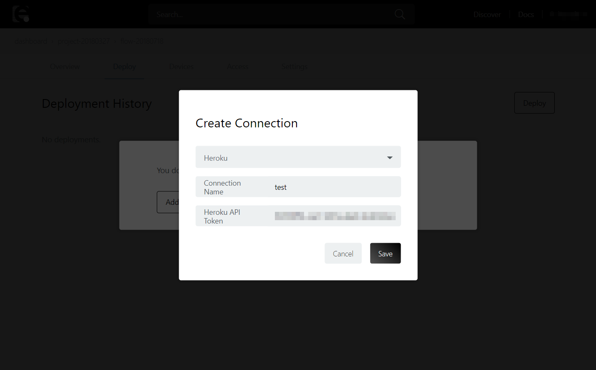

::: {.book}
::: {.book-summary}
::: {#book-search-input role="search"}
:::

-   Getting Started
-   [Introduction](http://docs.enebular.com/ja/)
-   [Getting Started](http://docs.enebular.com/ja/getstarted/)
    -   [Introduction](http://docs.enebular.com/ja/getstarted/Introduction.html)
    -   [Flow
        Deployment](http://docs.enebular.com/ja/getstarted/FlowDeployment.html)
    -   [Data
        Visualization](http://docs.enebular.com/ja/getstarted/DataVisualization.html)
-   How to use enebular
-   Projects
    -   [About Projects](http://docs.enebular.com/ja/Project/)
    -   [Project
        Settings](http://docs.enebular.com/ja/Project/Settings.html)
-   Flows
    -   [Introduction](http://docs.enebular.com/ja/Flows/Introduction.html)
    -   [Creating
        Flows](http://docs.enebular.com/ja/Flows/CreateFlow.html)
    -   [Example:
        Milkcocoa](http://docs.enebular.com/ja/Flows/FlowExampleMilkcocoa.html)
    -   [Publishing
        Flows](http://docs.enebular.com/ja/Flows/PublishFlow.html)
-   Files
    -   [Introduction](http://docs.enebular.com/ja/Files/)
    -   [Registering
        Files](http://docs.enebular.com/ja/Files/RegisterFile.html)
    -   [Deploying
        Files](http://docs.enebular.com/ja/Files/DeployFile.html)
    -   [Accessing Files From
        Flows](http://docs.enebular.com/ja/Files/AccessFileFromFlow.html)
    -   [File
        Settings](http://docs.enebular.com/ja/Files/FileSettings.html)
-   InfoMotion
    -   [Introduction](http://docs.enebular.com/ja/InfoMotion/Introduction.html)
    -   [InfoType](http://docs.enebular.com/ja/InfoMotion/InfoTypeIntroduction.html)
        -   [Creating an
            InfoType](http://docs.enebular.com/ja/InfoMotion/InfoMotionTool.html)
        -   [Uploading an
            InfoType](http://docs.enebular.com/ja/InfoMotion/UploadInfoType.html)
        -   [Sample
            InfoTypes](http://docs.enebular.com/ja/InfoMotion/SampleInfoTypes.html)
        -   [API
            Reference](http://docs.enebular.com/ja/InfoMotion/APIReference.html)
    -   [Data
        Source](http://docs.enebular.com/ja/InfoMotion/CreateDataSource.html)
        -   [Data Source
            Schema](http://docs.enebular.com/ja/InfoMotion/DataSourceSchema.html)
        -   Milkcocoa-v2
            -   [Set-up](http://docs.enebular.com/ja/InfoMotion/DataSource/Milkcocoa/Setup.html)
            -   [Create a Data
                Source](http://docs.enebular.com/ja/InfoMotion/DataSource/Milkcocoa/CreateDataSource.html)
            -   [Create
                Flow](http://docs.enebular.com/ja/InfoMotion/DataSource/Milkcocoa/CreateFlow.html)
            -   [Running
                Local](http://docs.enebular.com/ja/InfoMotion/DataSource/Milkcocoa/RunningLocal.html)
        -   Firebase
            -   [Set-up](http://docs.enebular.com/ja/InfoMotion/DataSource/Firebase/Setup.html)
            -   [Create a Data
                Source](http://docs.enebular.com/ja/InfoMotion/DataSource/Firebase/CreateDataSource.html)
            -   [Create
                Flow](http://docs.enebular.com/ja/InfoMotion/DataSource/Firebase/CreateFlow.html)
        -   Pubnub
            -   [Set-up](http://docs.enebular.com/ja/InfoMotion/DataSource/Pubnub/Setup.html)
            -   [Create a Data
                Source](http://docs.enebular.com/ja/InfoMotion/DataSource/Pubnub/CreateDataSource.html)
            -   [Create
                Flow](http://docs.enebular.com/ja/InfoMotion/DataSource/Pubnub/CreateFlow.html)
        -   API Gateway
            -   [Set up & Create Lambda
                Function](http://docs.enebular.com/ja/InfoMotion/DataSource/APIGateway/CreateLambdaFunction.html)
            -   [Create a Data
                Source](http://docs.enebular.com/ja/InfoMotion/DataSource/APIGateway/CreateDataSource.html)
        -   NEC BaaS
            -   [Create a Data
                Source](http://docs.enebular.com/ja/InfoMotion/DataSource/NEC-BaaS/CreateDataSource.html)
        -   Random
            -   [How to use Random Data
                Source](http://docs.enebular.com/ja/InfoMotion/DataSource/Random/SetUp.html)
    -   [Dashboards](http://docs.enebular.com/ja/InfoMotion/CreateInfoMotion.html)
    -   [Sharing an
        InfoMotion](http://docs.enebular.com/ja/InfoMotion/ShareInfoMotion.html)
-   Deploys
    -   [Introduction](http://docs.enebular.com/ja/Deploy/)
    -   [AWS IoT](http://docs.enebular.com/ja/Deploy/DeployFlow/AWSIoT/)
        -   [Create
            Connection](http://docs.enebular.com/ja/Deploy/DeployFlow/AWSIoT/MakeAWSIoTConnection.html)
    -   [Heroku](http://docs.enebular.com/ja/Deploy/DeployFlow/Heroku/)
    -   [Pelion Device
        Management](http://docs.enebular.com/ja/Deploy/DeployFlow/mbed/)
    -   [AWS
        Lambda](http://docs.enebular.com/ja/Deploy/DeployFlow/Lambda/)
-   Devices
    -   [Device
        List](http://docs.enebular.com/ja/Device/DeviceList.html)
        -   [Flow
            Status](http://docs.enebular.com/ja/Device/FlowStatus.html)
        -   [Filtering](http://docs.enebular.com/ja/Device/DeviceFiltering.html)
        -   [Logs](http://docs.enebular.com/ja/Device/Logs.html)
    -   [License
        Manager](http://docs.enebular.com/ja/Device/LicenseManager.html)
-   Config
    -   [Connections](http://docs.enebular.com/ja/Config/Connections.html)
    -   [Access](http://docs.enebular.com/ja/Config/Access.html)
    -   [Billing
        Information](http://docs.enebular.com/ja/Config/BillingInformation.html)
-   Discover
    -   [Discovering Assets](http://docs.enebular.com/ja/Discover/)
    -   [Unpublish
        Assets](http://docs.enebular.com/ja/Discover/UnpublishAssets.html)
-   Account
    -   [Account Settings](http://docs.enebular.com/ja/Account/)
-   enebular editor
    -   [Introduction](http://docs.enebular.com/ja/EnebularEditor/)
    -   [Remote
        Mode](http://docs.enebular.com/ja/EnebularEditor/RemoteMode.html)
-   enebular-agent
    -   [Overview](http://docs.enebular.com/ja/EnebularAgent/Overview.html)
    -   [Installation](http://docs.enebular.com/ja/EnebularAgent/Installation.html)
    -   [Updater](http://docs.enebular.com/ja/EnebularAgent/Updater.html)
    -   [User /
        Folder](http://docs.enebular.com/ja/EnebularAgent/UserFolder.html)
    -   [Start /
        Stop](http://docs.enebular.com/ja/EnebularAgent/StartStop.html)
    -   [Node-RED](http://docs.enebular.com/ja/EnebularAgent/Node-RED.html)
    -   [Status](http://docs.enebular.com/ja/EnebularAgent/Status.html)
    -   [Log](http://docs.enebular.com/ja/EnebularAgent/Log.html)
    -   [Developer
        Mode](http://docs.enebular.com/ja/EnebularAgent/Developer-Mode.html)
-   enebular-edge-agent
    -   [Introduction](http://docs.enebular.com/ja/EnebularEdgeAgent/Introduction.html)
    -   [GettingStarted](http://docs.enebular.com/ja/EnebularEdgeAgent/GettingStarted.html)
    -   [Features](http://docs.enebular.com/ja/EnebularEdgeAgent/Features.html)
    -   [Tools](http://docs.enebular.com/ja/EnebularEdgeAgent/Tools.html)
    -   [Configuration](http://docs.enebular.com/ja/EnebularEdgeAgent/Configuration.html)
    -   [Nodes](http://docs.enebular.com/ja/EnebularEdgeAgent/Nodes.html)
    -   [SampleFlows](http://docs.enebular.com/ja/EnebularEdgeAgent/SampleFlows.html)
    -   [Board](http://docs.enebular.com/ja/Board/Introduction.html)
        -   [RAVEN](http://docs.enebular.com/ja/Board/RAVEN.html)
-   Resources
-   Supported Environments
    -   [enebular](http://docs.enebular.com/ja/Other/Support.html#enebular)
    -   [enebular
        editor](http://docs.enebular.com/ja/Other/Support.html#enebularEditor)
    -   [enebular-agent](http://docs.enebular.com/ja/Other/Support.html#enebular-agent)
    -   [enebular-edge-agent](http://docs.enebular.com/ja/Other/Support.html#enebular-edge-agent)
-   Hardware TechnicalDetail
    -   [RAVEN](http://docs.enebular.com/ja/Other/HWSpec-RAVEN.html)
-   Release Notes
    -   [enebular](http://docs.enebular.com/ja/Releases/#enebular)
        -   [2.13.0](http://docs.enebular.com/ja/Releases/enebular/2.13.0.html)
        -   [2.12.0](http://docs.enebular.com/ja/Releases/enebular/2.12.0.html)
        -   [2.11.1](http://docs.enebular.com/ja/Releases/enebular/2.11.1.html)
        -   [2.11.0](http://docs.enebular.com/ja/Releases/enebular/2.11.0.html)
        -   [2.10.1](http://docs.enebular.com/ja/Releases/enebular/2.10.1.html)
        -   [2.10.0](http://docs.enebular.com/ja/Releases/enebular/2.10.0.html)
        -   [2.9.0](http://docs.enebular.com/ja/Releases/enebular/2.9.0.html)
        -   [2.8.4](http://docs.enebular.com/ja/Releases/enebular/2.8.4.html)
        -   [2.8.3](http://docs.enebular.com/ja/Releases/enebular/2.8.3.html)
        -   [2.8.2](http://docs.enebular.com/ja/Releases/enebular/2.8.2.html)
        -   [2.8.1](http://docs.enebular.com/ja/Releases/enebular/2.8.1.html)
        -   [2.8.0](http://docs.enebular.com/ja/Releases/enebular/2.8.0.html)
        -   [2.7.3](http://docs.enebular.com/ja/Releases/enebular/2.7.3.html)
        -   [2.7.2](http://docs.enebular.com/ja/Releases/enebular/2.7.2.html)
        -   [2.7.1](http://docs.enebular.com/ja/Releases/enebular/2.7.1.html)
        -   [2.7.0](http://docs.enebular.com/ja/Releases/enebular/2.7.0.html)
        -   [2.6.1](http://docs.enebular.com/ja/Releases/enebular/2.6.1.html)
        -   [2.6.0](http://docs.enebular.com/ja/Releases/enebular/2.6.0.html)
        -   [2.5.2](http://docs.enebular.com/ja/Releases/enebular/2.5.2.html)
        -   [2.5.1](http://docs.enebular.com/ja/Releases/enebular/2.5.1.html)
        -   [2.5.0](http://docs.enebular.com/ja/Releases/enebular/2.5.0.html)
        -   [2.4.4](http://docs.enebular.com/ja/Releases/enebular/2.4.4.html)
        -   [2.4.3](http://docs.enebular.com/ja/Releases/enebular/2.4.3.html)
        -   [2.4.2](http://docs.enebular.com/ja/Releases/enebular/2.4.2.html)
        -   [2.4.1](http://docs.enebular.com/ja/Releases/enebular/2.4.1.html)
        -   [2.4.0](http://docs.enebular.com/ja/Releases/enebular/2.4.0.html)
        -   [2.3.1](http://docs.enebular.com/ja/Releases/enebular/2.3.1.html)
        -   [2.3.0](http://docs.enebular.com/ja/Releases/enebular/2.3.0.html)
        -   [2.2.1](http://docs.enebular.com/ja/Releases/enebular/2.2.1.html)
        -   [2.2.0](http://docs.enebular.com/ja/Releases/enebular/2.2.0.html)
        -   [2.1.2](http://docs.enebular.com/ja/Releases/enebular/2.1.2.html)
        -   [2.1.1](http://docs.enebular.com/ja/Releases/enebular/2.1.1.html)
        -   [2.1.0](http://docs.enebular.com/ja/Releases/enebular/2.1.0.html)
        -   [2.0.1](http://docs.enebular.com/ja/Releases/enebular/2.0.1.html)
        -   [2.0.0](http://docs.enebular.com/ja/Releases/enebular/2.0.0.html)
    -   [enebular-agent](http://docs.enebular.com/ja/Releases/#enebular-agent)
        -   [2.6.0](http://docs.enebular.com/ja/Releases/enebular-agent/2.6.0.html)
        -   [2.5.0](http://docs.enebular.com/ja/Releases/enebular-agent/2.5.0.html)
        -   [2.4.0](http://docs.enebular.com/ja/Releases/enebular-agent/2.4.0.html)
        -   [2.3.0](http://docs.enebular.com/ja/Releases/enebular-agent/2.3.0.html)
        -   [2.2.0](http://docs.enebular.com/ja/Releases/enebular-agent/2.2.0.html)
        -   [2.1.0](http://docs.enebular.com/ja/Releases/enebular-agent/2.1.0.html)
        -   [2.0.0](http://docs.enebular.com/ja/Releases/enebular-agent/2.0.0.html)
    -   [enebular-edge-agent](http://docs.enebular.com/ja/Releases/#enebular-edge-agent)
        -   [1.5.0](http://docs.enebular.com/ja/Releases/enebular-edge-agent/1.5.0.html)
        -   [1.4.0](http://docs.enebular.com/ja/Releases/enebular-edge-agent/1.4.0.html)
        -   [1.3.0](http://docs.enebular.com/ja/Releases/enebular-edge-agent/1.3.0.html)
        -   [1.2.2](http://docs.enebular.com/ja/Releases/enebular-edge-agent/1.2.2.html)
        -   [1.2.1](http://docs.enebular.com/ja/Releases/enebular-edge-agent/1.2.1.html)
        -   [1.2.0](http://docs.enebular.com/ja/Releases/enebular-edge-agent/1.2.0.html)
        -   [1.1.0](http://docs.enebular.com/ja/Releases/enebular-edge-agent/1.1.0.html)
        -   [1.0.1](http://docs.enebular.com/ja/Releases/enebular-edge-agent/1.0.1.html)
        -   [1.0.0](http://docs.enebular.com/ja/Releases/enebular-edge-agent/1.0.0.html)
        -   [0.10.0](http://docs.enebular.com/ja/Releases/enebular-edge-agent/0.10.0.html)
        -   [0.9.1](http://docs.enebular.com/ja/Releases/enebular-edge-agent/0.9.1.html)
        -   [0.9.0](http://docs.enebular.com/ja/Releases/enebular-edge-agent/0.9.0.html)
    -   [enebular
        editor](http://docs.enebular.com/ja/Releases/#enebular-editor)
        -   [0.10.2](http://docs.enebular.com/ja/Releases/enebular-editor/0.10.2.html)
        -   [0.10.1](http://docs.enebular.com/ja/Releases/enebular-editor/0.10.1.html)
        -   [0.10.0](http://docs.enebular.com/ja/Releases/enebular-editor/0.10.0.html)
        -   [0.9.3](http://docs.enebular.com/ja/Releases/enebular-editor/0.9.3.html)
        -   [0.9.2](http://docs.enebular.com/ja/Releases/enebular-editor/0.9.2.html)
        -   [0.9.1](http://docs.enebular.com/ja/Releases/enebular-editor/0.9.1.html)
        -   [0.9.0](http://docs.enebular.com/ja/Releases/enebular-editor/0.9.0.html)
-   -   [GitBookで公開](https://www.gitbook.com){.gitbook-link}
:::

::: {.book-body}
::: {.body-inner}
::: {.book-header role="navigation"}
 [Flow Deployment](http://docs.enebular.com/ja/)
===============================================
:::

::: {.page-wrapper tabindex="-1" role="main"}
::: {.page-inner}
::: {#book-search-results}
::: {.search-noresults}
::: {.section .normal .markdown-section}
Flow Deployment {#Flow Deployment}
===============

enebular
の特徴として、作成したフローを様々な環境にデプロイし動作させるというものがあります。
このチュートリアルでは、「フローを別のサービス（Heroku）にデプロイし動作する」ということをします。（所要時間40分）

このチュートリアルでは以下のことを行います。

なお、本ページは
[Introduction](http://docs.enebular.com/ja/getstarted/Introduction.html)
のチュートリアルで Asset(フロー)
の作成方法については理解していることを前提としています。
Herokuアカウントの取得については、[Heroku](https://heroku.com)
から進めてください。

Table of Contents {#TableofContents}
-----------------

1.  [Heroku
    に送るフローを作成](FlowDeployment.html#Herokuに送るフローを作成)
2.  [デプロイの設定](FlowDeployment.html#デプロイの設定)
3.  [Heroku
    ボタンでアプリを作成](FlowDeployment.html#Herokuボタンでアプリを作成)
4.  [フローのデプロイ](FlowDeployment.html#フローのデプロイ)

Heroku に送るフローを作成 {#Heroku に送るフローを作成}
-------------------------

 Assets
からフローを作成します（既にフローを作成済みの場合、それを利用することも可能です）。

Heroku に送りたいフローを作成して、デプロイして保存します。

デプロイの設定
--------------

つづいて、デプロイの設定をします。\
フローが作成できたら上部のメニューから Deploy ページに移動します。

表示された画面の Add Connection をクリックします。

Select Connection Type から Heroku を選択します。 Connection Name
はわかりやすい名前をつけます。Heroku API Token は Heroku
の設定画面で確認します。

Herokuにログイン後ページ右上にある \[Account Settings\] を押します。

Manage Account ページで Account ページに移動します。

API Key 欄に移動し \[Reveal\] で API Key を表示します。

Heroku API Token に API Key をコピーして、\[Save\] を押します。

新しくconnectionが追加されたので、クリックしてください。

開いた画面の下部にある \[Deploy to Heroku\] からアプリを作成します。

Heroku ボタンでアプリを作成 {#Heroku ボタンでアプリを作成}
---------------------------

Heroku
ボタンでアプリを作成します。すでに作成されている方は読み飛ばして下さい。\
Heroku ボタンを押すとログインしていない場合、Heroku
のログイン画面が出てくるのでログインします。

Heroku のアプリ設定が表示されます。

App name をわかりやすい名前で設定します。

作成後 の enebular Node-RED のログインするための USERNAME/PASSWORD
を設定します。

入力が完了したら Deploy app ボタンを押下してデプロイを行ってください。

Heroku
にクレジットカード情報を登録していない場合、以下のような入力画面が出ますが、本アプリは無料で利用できますので入力して継続ください。

情報を入力すると、アプリの作成が始まります。

下記のようにアプリが作成されていきます。 アプリの作成が完了すると View
ボタンが表示されるので押下します。

アプリが立ち上がり、enebular にログインするための USERNAME/PASSWORD
の入力を求められます。\
さきほど設定したものを入力してログインします。エディタが表示されることを確認します。

フローのデプロイ
----------------

保存されると Select Connection Type から Heroku を選択すると、Heroku
アカウントが持つアプリ一覧が出てきます。

こちらから、さきほど作成した Heroku アプリをひとつチェックし \[Deploy\]
を押します。

しばらく待っていると Deploy Added が表示されてデプロイが完了します。

Heroku アプリで確認すると無事フローがデプロイされています。

反映されたフローを確認します。

Well Done! {#Well Done!}
----------

enebular のデプロイ機能を使用して、作成した
Asset(フロー)を別のサービスにデプロイすることが出来るようになりました。
:::
:::

::: {.search-results}
::: {.has-results}
[]{.search-results-count} results matching \"[]{.search-query}\" {#results-matching .search-results-title}
================================================================
:::

::: {.no-results}
No results matching \"[]{.search-query}\" {#no-results-matching .search-results-title}
=========================================
:::
:::
:::
:::
:::
:::

{.navigation
.navigation-prev}
{.navigation
.navigation-next}
:::
:::
